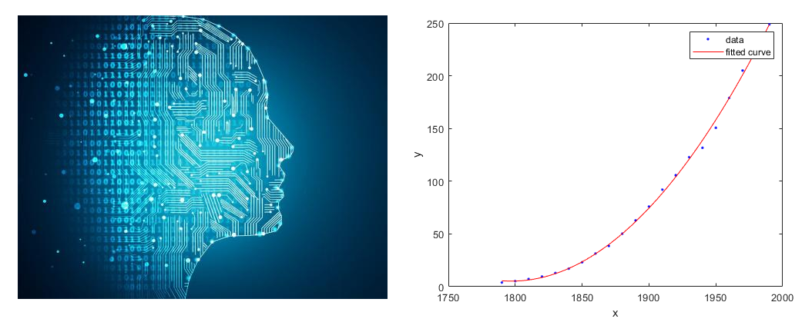

# [AI today and tomorrow is mostly about curve fitting, not intelligence](https://diginomica.com/ai-curve-fitting-not-intelligence)

# 현재의 인공지능은 지능이 아니라 단순한 커브피팅(Curve Fitting)이다

By [마르코 커트](https://diginomica.com/author/kmarko) 2018/06/03

- 요약:

  인공지능에서 '지능'에 대한 중요한 학술적 논의가 대두되고 있다. 그것은 현재에 무엇이 가능한지, 그리고 미래에 어디까지 가능할지에 대한 수준을 정하는데 도움이 된다. 여기에 어디까지가 진실이고, 상상인지에 대한 가이드가 있다.  

유디 펄 - ACM 튜링상 수상자

인공지능의 가치에 대한 논의가 계속되면서, ['인공지능의 겨울'](https://ko.wikipedia.org/wiki/인공지능#인공지능의_겨울)에 대한 [위험](https://venturebeat.com/2018/04/11/overblown-expectations-for-autonomous-cars-could-force-the-next-ai-winter/)은 리얼이다. 우리는 무엇이 진실인지, 무엇이 상상인지 레벨을 설정하여 다음의 엄청난 혁신에 대한 기사가 적절하게 맥락화되도록 해야한다.   

의심 할 여지없이, 최근 머신러닝과 딥러닝을 이용한 인공지능에 대한 관심의 급증은 많은 소프트웨어 분야에 있어서 엄청난 발전의 배후이다.  SF 영화에서나 볼법한 언어 번역, 이미지 장면 인식, 그리고 대화형 인터페이스(챗봇 등) 같은 발전은 이제 현실이 되었다.  하지만 [소프트웨어는 사실 인공적이든 뭐든간에 '지능적'이지 않다](https://diginomica.com/ai-dumb-leading-incrementalism-not-transformation)라는 좌절감이 커지고 있다. 인공지능 꼬리표를 달고 나온 소프트웨어가 대부분의 소프트웨어 분야에서 엄청난 발전을 낳았음에도 불구하고, 학계와 회의론자들은 [이런 알고리즘이 '지능적'과는 상당히 거리가 있다](https://diginomica.com/2017/01/13/when-algorithms-fail-who-you-gonna-call/)는 것을 발견했다.

## 지능의 정의

지능이 무엇인가에 대한 논의는 (기계 말고) 동물 세계과 인류를 구분하는 것에 관심있던 그리스 철학자들에게로 거슬러 올라간다. 아리스토텔레스는 잘 알려져있듯이 "어떤 생각에 동의하지 않고도 그 생각을 해볼 수 있는 것이 교육 받은 사람의 특징이다." 라고 말했다. 그의 격언이 '생물학적 지능'과 여러가지 인공적인 것들을 구분하는데 사용될 것이라고 생각한 사람은 드물었다.

Debates over the meaning of intellect date back to the Greek philosophers who were primarily concerned with what differentiated mankind from the animal kingdom, not machines. Aristotle famously stated that the mark of an educated mind is the ability to entertain a thought without accepting it. Little did he conceive that his maxim might equally be used to distinguish between biological intelligence and the artificial variety.

Our machines are still incapable of independently coming up with a thought or hypothesis, testing it against others and accepting or rejecting its validity based on reasoning and experimentation, i.e. following the [core principles of the scientific method.](https://courses.lumenlearning.com/boundless-psychology/chapter/the-scientific-method/)

While some forms of AI, like [adversarial networks](https://deeplearning4j.org/generative-adversarial-network), might play opposing goals against each other to reach an optimal result, few would call such algorithmic reasoning ‘intelligent.’

Rather, it’s a more effective means of achieving a defined goal by having two neural networks work at cross-purposes using a common data set, to achieve a more accurate model than either one alone.

The critical intellectual distinction between humans and machines is the ability to define goals and reason towards achieving them. It is also the ability to distinguish between cause and effect, understanding that despite two events often happen in close proximity, doesn’t mean that one *caused* the other. The [correlation-causation fallacy](https://en.wikipedia.org/wiki/Correlation_does_not_imply_causation), often seen in public discourse, is one of the most common logical errors.

## AI - learning or describing?

An emerging debate among AI researchers is whether current machine and deep learning techniques amount a fundamentally new form of algorithmic reasoning or are merely an extension of longstanding mathematical techniques like descriptive statistics and curve fitting.

In the latter camp is the influential [professor of computer science](http://bayes.cs.ucla.edu/jp_home.html) and [Turing award winner](https://en.wikipedia.org/wiki/Turing_Award) Judea Pearl who’s [new book](https://www.basicbooks.com/titles/judea-pearl/the-book-of-why/9780465097609/) on the science of cause and effect has ignited a discussion about the future of AI and whether deep learning can lead to anything approaching general human intelligence.

Pearl had some trenchant observations in a [recent interview](https://www.quantamagazine.org/to-build-truly-intelligent-machines-teach-them-cause-and-effect-20180515/) in which he covered both the ideas in his book and views on the state of AI software, including how the inability of current AI to perform causal reasoning is a severe shortcoming. His assessment of deep learning is both unsparing and enlightening (***emphasis added\***),

> As much as I look into what’s being done with deep learning, I see **they’re all stuck there on the level of associations. Curve fitting.** That sounds like sacrilege, to say that all the impressive achievements of deep learning amount to just fitting a curve to data. From the point of view of the mathematical hierarchy, **no matter how skillfully you manipulate the data and what you read into the data when you manipulate it, it’s still a curve-fitting exercise, albeit complex and nontrivial**.

In essence, despite their cerebral inspiration, deep learning algorithms amount to another, albeit more powerful data analysis tool that is particularly adept at handling vast amounts of unstructured data.

Nevertheless, deep learning is an exceptionally versatile and powerful curve fitting technique that can identify previously hidden patterns, extrapolate trends and predict results across a broad spectrum of problems. One risk with curve fitting approaches that are too good at representing a given data set is [overfitting](https://en.wikipedia.org/wiki/Overfitting), in which the algorithm fails to recognize normal fluctuations in data and ends up being whipsawed by noise.

Pearl acknowledges that the success of deep learning has surprised even experts in the field, but he worries that it could cause researchers to get stuck in a conceptual rut and jeopardize progress towards [general forms of AI](https://en.wikipedia.org/wiki/Artificial_general_intelligence) (***emphasis added\***).

> I’m very impressed, because we did not expect that so many problems could be solved by pure curve fitting. It turns out they can. **But I’m asking about the future — what next?**

AI researchers are aligning into factions defined by their view of deep learning with its most staunch advocates unreceptive to any criticism. Pearl characterizes the environment this way (***emphasis added\***),

> AI is currently split. First, there are those who are intoxicated by the success of machine learning and deep learning and neural nets. **They don’t understand what I’m talking about. They want to continue to fit curves**. **But when you talk to people who have done any work in AI outside statistical learning, they get it immediately**. I have read several papers written in the past two months about the limitations of machine learning.

Pearl contends that until algorithms and the machines controlled by them can reason about cause and effect, or at least conceptualize the difference, their utility and versatility will never approach that of humans.

He says that it will be impossible to have meaningful dialog with robots until they can simulate human intuition, which requires the ability to understand cause and effect along with alternative actions and outcomes that it might have taken. In short, we're back to Aristotle.

While he might be in the minority, Pearl isn’t alone in recognizing the need for AI to think (sic) beyond deep learning before it can build machines that think like people.

A [paper by MIT researchers](http://www.mit.edu/~tomeru/papers/machines_that_think.pdf) argues that creating human-like learning and thinking machines requires that they be capable of building causal models of the world that can understand and explain their environment, not just solve problems using pattern recognition.

The paper also contends that such systems must be grounded in both the physical (physics) and social (psychology) sciences to have any capability for intuitive reasoning about the world that would enable machines to “rapidly acquire and generalize knowledge to new tasks and situations.” Much like Pearl, the authors conclude with an exhortation to AI researchers (***emphasis added\***),

> Rather than just building systems that recognize handwritten characters and play Frostbite or Go as the end result of an asymptotic process, **we suggest that deep learning and other computational paradigms should aim to tackle these tasks using as little training data as people need**, and also to **evaluate models on a range of human-like generalizations beyond the one task the model was trained on.**

Such *artificial general intelligence* (AGI) is the stuff of dystopian novels and warnings from tech luminaries like [Elon Musk](https://www.npr.org/sections/thetwo-way/2017/07/17/537686649/elon-musk-warns-governors-artificial-intelligence-poses-existential-risk) and [Bill Gates](https://www.theguardian.com/technology/2015/jan/29/artificial-intelligence-strong-concern-bill-gates). The worst case scenarios are unlikely to be achieved anytime soon, or perhaps ever, if as Pearl fears, researchers keep refining existing techniques and don’t expand their conceptual horizons.

## My take

Although I frequently use the term AI, it’s always with reluctance and out of convention and not conviction.

Much like IoT and cloud, epithets that are equally abused and imprecise, AI is a widely understood, convenient shorthand for a set of techniques that are increasingly powerful, yet fundamentally distinct from human intelligence and rationality.

While I regularly chronicle the impressive applications of today’s ML and deep learning software, I’ve recognized that it is a stretch to call it ‘intelligent’. Perhaps ‘adaptive’ and ‘self-optimizing’ are better terms. Even these come with caveats since the models require extensive human tuning of parameters and structure, as I’ve discussed [here](https://diginomica.com/2017/05/25/ai-business-still-hard-waiting-netscape-moment/) and [here](https://diginomica.com/2017/08/09/automated-deep-learning-finding-right-model/).

The technology industry writ large needs to have a collective epiphany regarding the state of AI technology.

Yes, celebrate its successes, but acknowledge that far more fundamental research is needed before we’ll have software that can be legitimately called intelligent.

Much work remains to teach machines causality, although [Pearl has already provided ](http://ftp.cs.ucla.edu/pub/stat_ser/r402.pdf)the necessary system of mathematics using Bayesian networks to [describe causal relationships in what he named Do-Calculus](https://arxiv.org/pdf/1305.5506v1.pdf).

In the meantime, users of various machine learning tools must be aware of their limitations and of not making categorical inferences from results from a particular problem and data set.

[기사 원본](https://diginomica.com/ai-curve-fitting-not-intelligence)  

　  

# AI today and tomorrow is mostly about curve fitting, not intelligence

By [Kurt Marko](https://diginomica.com/author/kmarko)June 3, 2018

- SUMMARY:

  Important academic discussions around the 'intelligence' in AI are emerging. They help level set the reality of what's possible now and into the future. Here's your guide as to what is real and what's imagined.

Judea Pearl - fellow ACM, Turing Award winner

As debates around AI's value continue, [the risk of an AI winter](https://venturebeat.com/2018/04/11/overblown-expectations-for-autonomous-cars-could-force-the-next-ai-winter/) is real. We need to level set what is real and what is imagined so that the next press release you see describing some amazing breakthrough is properly contextualized.

Unquestionably, the latest spike of interest in AI technology using machine learning and the neuron-inspired deep learning is behind incredible advancements in many software categories.

Achievements such as language translation, image and scene recognition and conversational UIs that were once the stuff of sci-fi dreams are now a reality.

However, there’s a growing frustration that the [software isn’t really “intelligent”, artificial or otherwise](https://diginomica.com/2018/05/21/ai-dumb-leading-incrementalism-not-transformation/). Even as software using AI-labeled techniques continues to yield tremendous improvements in most software categories, both academics and skeptical observers have observed that [such algorithms fall far short](https://diginomica.com/2017/01/13/when-algorithms-fail-who-you-gonna-call/) of what can be reasonably considered intelligent.

## Defining intelligence

Debates over the meaning of intellect date back to the Greek philosophers who were primarily concerned with what differentiated mankind from the animal kingdom, not machines. Aristotle famously stated that the mark of an educated mind is the ability to entertain a thought without accepting it. Little did he conceive that his maxim might equally be used to distinguish between biological intelligence and the artificial variety.

Our machines are still incapable of independently coming up with a thought or hypothesis, testing it against others and accepting or rejecting its validity based on reasoning and experimentation, i.e. following the [core principles of the scientific method.](https://courses.lumenlearning.com/boundless-psychology/chapter/the-scientific-method/)

While some forms of AI, like [adversarial networks](https://deeplearning4j.org/generative-adversarial-network), might play opposing goals against each other to reach an optimal result, few would call such algorithmic reasoning ‘intelligent.’

Rather, it’s a more effective means of achieving a defined goal by having two neural networks work at cross-purposes using a common data set, to achieve a more accurate model than either one alone.

The critical intellectual distinction between humans and machines is the ability to define goals and reason towards achieving them. It is also the ability to distinguish between cause and effect, understanding that despite two events often happen in close proximity, doesn’t mean that one *caused* the other. The [correlation-causation fallacy](https://en.wikipedia.org/wiki/Correlation_does_not_imply_causation), often seen in public discourse, is one of the most common logical errors.

## AI - learning or describing?

An emerging debate among AI researchers is whether current machine and deep learning techniques amount a fundamentally new form of algorithmic reasoning or are merely an extension of longstanding mathematical techniques like descriptive statistics and curve fitting.

In the latter camp is the influential [professor of computer science](http://bayes.cs.ucla.edu/jp_home.html) and [Turing award winner](https://en.wikipedia.org/wiki/Turing_Award) Judea Pearl who’s [new book](https://www.basicbooks.com/titles/judea-pearl/the-book-of-why/9780465097609/) on the science of cause and effect has ignited a discussion about the future of AI and whether deep learning can lead to anything approaching general human intelligence.

Pearl had some trenchant observations in a [recent interview](https://www.quantamagazine.org/to-build-truly-intelligent-machines-teach-them-cause-and-effect-20180515/) in which he covered both the ideas in his book and views on the state of AI software, including how the inability of current AI to perform causal reasoning is a severe shortcoming. His assessment of deep learning is both unsparing and enlightening (***emphasis added\***),

> As much as I look into what’s being done with deep learning, I see **they’re all stuck there on the level of associations. Curve fitting.** That sounds like sacrilege, to say that all the impressive achievements of deep learning amount to just fitting a curve to data. From the point of view of the mathematical hierarchy, **no matter how skillfully you manipulate the data and what you read into the data when you manipulate it, it’s still a curve-fitting exercise, albeit complex and nontrivial**.

In essence, despite their cerebral inspiration, deep learning algorithms amount to another, albeit more powerful data analysis tool that is particularly adept at handling vast amounts of unstructured data.

Nevertheless, deep learning is an exceptionally versatile and powerful curve fitting technique that can identify previously hidden patterns, extrapolate trends and predict results across a broad spectrum of problems. One risk with curve fitting approaches that are too good at representing a given data set is [overfitting](https://en.wikipedia.org/wiki/Overfitting), in which the algorithm fails to recognize normal fluctuations in data and ends up being whipsawed by noise.

Pearl acknowledges that the success of deep learning has surprised even experts in the field, but he worries that it could cause researchers to get stuck in a conceptual rut and jeopardize progress towards [general forms of AI](https://en.wikipedia.org/wiki/Artificial_general_intelligence) (***emphasis added\***).

> I’m very impressed, because we did not expect that so many problems could be solved by pure curve fitting. It turns out they can. **But I’m asking about the future — what next?**

AI researchers are aligning into factions defined by their view of deep learning with its most staunch advocates unreceptive to any criticism. Pearl characterizes the environment this way (***emphasis added\***),

> AI is currently split. First, there are those who are intoxicated by the success of machine learning and deep learning and neural nets. **They don’t understand what I’m talking about. They want to continue to fit curves**. **But when you talk to people who have done any work in AI outside statistical learning, they get it immediately**. I have read several papers written in the past two months about the limitations of machine learning.

Pearl contends that until algorithms and the machines controlled by them can reason about cause and effect, or at least conceptualize the difference, their utility and versatility will never approach that of humans.

He says that it will be impossible to have meaningful dialog with robots until they can simulate human intuition, which requires the ability to understand cause and effect along with alternative actions and outcomes that it might have taken. In short, we're back to Aristotle.

While he might be in the minority, Pearl isn’t alone in recognizing the need for AI to think (sic) beyond deep learning before it can build machines that think like people.

A [paper by MIT researchers](http://www.mit.edu/~tomeru/papers/machines_that_think.pdf) argues that creating human-like learning and thinking machines requires that they be capable of building causal models of the world that can understand and explain their environment, not just solve problems using pattern recognition.

The paper also contends that such systems must be grounded in both the physical (physics) and social (psychology) sciences to have any capability for intuitive reasoning about the world that would enable machines to “rapidly acquire and generalize knowledge to new tasks and situations.” Much like Pearl, the authors conclude with an exhortation to AI researchers (***emphasis added\***),

> Rather than just building systems that recognize handwritten characters and play Frostbite or Go as the end result of an asymptotic process, **we suggest that deep learning and other computational paradigms should aim to tackle these tasks using as little training data as people need**, and also to **evaluate models on a range of human-like generalizations beyond the one task the model was trained on.**

Such *artificial general intelligence* (AGI) is the stuff of dystopian novels and warnings from tech luminaries like [Elon Musk](https://www.npr.org/sections/thetwo-way/2017/07/17/537686649/elon-musk-warns-governors-artificial-intelligence-poses-existential-risk) and [Bill Gates](https://www.theguardian.com/technology/2015/jan/29/artificial-intelligence-strong-concern-bill-gates). The worst case scenarios are unlikely to be achieved anytime soon, or perhaps ever, if as Pearl fears, researchers keep refining existing techniques and don’t expand their conceptual horizons.

## My take

Although I frequently use the term AI, it’s always with reluctance and out of convention and not conviction.

Much like IoT and cloud, epithets that are equally abused and imprecise, AI is a widely understood, convenient shorthand for a set of techniques that are increasingly powerful, yet fundamentally distinct from human intelligence and rationality.

While I regularly chronicle the impressive applications of today’s ML and deep learning software, I’ve recognized that it is a stretch to call it ‘intelligent’. Perhaps ‘adaptive’ and ‘self-optimizing’ are better terms. Even these come with caveats since the models require extensive human tuning of parameters and structure, as I’ve discussed [here](https://diginomica.com/2017/05/25/ai-business-still-hard-waiting-netscape-moment/) and [here](https://diginomica.com/2017/08/09/automated-deep-learning-finding-right-model/).

The technology industry writ large needs to have a collective epiphany regarding the state of AI technology.

Yes, celebrate its successes, but acknowledge that far more fundamental research is needed before we’ll have software that can be legitimately called intelligent.

Much work remains to teach machines causality, although [Pearl has already provided ](http://ftp.cs.ucla.edu/pub/stat_ser/r402.pdf)the necessary system of mathematics using Bayesian networks to [describe causal relationships in what he named Do-Calculus](https://arxiv.org/pdf/1305.5506v1.pdf).

In the meantime, users of various machine learning tools must be aware of their limitations and of not making categorical inferences from results from a particular problem and data set.

[Source](https://diginomica.com/ai-curve-fitting-not-intelligence)  