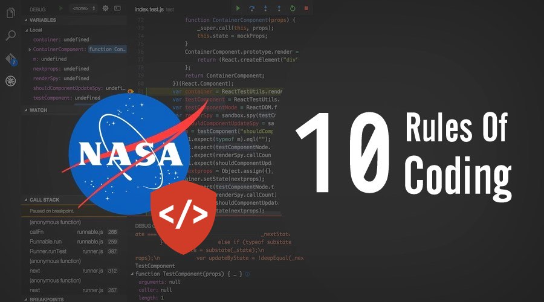

# [NASA's 10 rules for writing mission-critical code](https://altbulletin.com/how-to-code-like-the-top-programmers-at-nasa-10-critical-rules/)

NASA의 개발자는 프로그래밍 세계에서 가장 힘든 직업중의 하나입니다. 안전을 최우선적으로, 미션에 중요한 어플리케이션을 개발하고 코드를 작성해나갑니다.

이런 상황에서, 몇가지 엄격한 코딩 가이드라인을 따르는것은 정말 중요합니다. 이 규칙은 소프트웨어가 어떻게 작성되어야 하는지, 어떤 특징의 언어를 사용해야하는지 등의 다양한 측면을 아우르죠.

물론 '좋은 코딩 표준'에 대한 합의를 세우기는 쉽지 않지만, NASA의 Jet Propulsion Laboratory(JPL)은 **안전한 핵심 코드를 개발하기 위한 10가지 규칙의 힘** 이라는 이름의 코딩 가이드라인을 따르고 있습니다.

이 가이드는 JPL의 언어특성상 C 프로그래밍에 초점을 두고 있습니다. 하지만 다른 프로그래밍 언어에도 쉽게 적용될 수 있습니다.

JPL의 수석 과학자 Gerard J. Holzmann은 이 엄격한 코딩 규칙들을 보안이 중점에 오도록 하였습니다.

　  

### 미션-크리티컬 코드 작성을 위한 NASA의 10가지 코딩규칙

1. **모든 코드를 매우 간단한 flow 구성으로 제한하라.**

   goto문, setjmp문, longjmp문, 직접재귀, 간접재귀를 사용하지 마라

2. **모든 loop에는 고정된 상한값이 있어야 한다.**

   loop가 상한값을 넘지 못한다는 것을 확인할 수 있는 정적인 값이 있어야 한다.

   이러한 정적인 값이 없다면 규칙을 위반한 것이다.

3. **초기화 이후에 동적 메모리 할당을 사용하지 마라.**

4. **한 페이지 안에 함수가 다 들어오도록 적어라(보통 60줄)** (한줄에 구문 1개씩으로 놓았을 때)

5. **`Assertion`은 한 함수당 최소 2개이상 써라.** 

   Assertion은 실측에서 절대 일어나면 안되는 비정상적인 조건을 확인하는데 사용된다.

   항상 부작용이 없어야 하며 `Boolean` test로 정의되야한다.

   Assertion이 실패하면 무조건 명시적인 복구 작업을 반환하라.

   (실패한 Assertion을 불러오는 함수를 호출해 에러 상태를 반환)

   절대 실패하지 않는 Assertion (`assert(true)`같은거) 는 카운트하지 않는다.

6. **객체는 항상 lowest-level에서 선언하라.**

7. **non-void 함수의 반환값은 항상 호출 함수에 의해 확인되어야 하며 파라미터의 유효성 또한 각 함수 내에서 확인되어야 한다.**

8. **preprocessor은 헤더파일의 포함 or 간단한 매크로의 정의만으로 제한되어야 한다.** 

   토큰 붙여넣기, 가변 인자 리스트 ( ... ; Ellipsis ),  재귀 매크로 호출은 항상 지양하라.

   모든 매크로는 완전한 문법의 구문 단위로 확장되어야 한다.

   조건적 컴파일 지시어은 애매하긴 한데 봐줄만 하다. 근데 대규모 프로젝트에서도 헤더파일 중복 선언은 써도 이건 1번 이상은 안쓴다. 쓸거면 Flag 세우고 왜 써야만 했는지 정당화하라.

9. **포인터의 사용은 제한되어야 한다.** 특히, 한번 이상의 역참조는 안된다.

   포인터의 역참조는 매크로 정의 부분이나 typedef 선언 안에 숨어있으면 안된다.

   함수 포인터도 안된다.

10. **개발 첫날부터 모든 코드는 컴파일러의 가장 까다로운 조건(모든 컴파일 에러 ON) 위에서도 컴파일 되어야 한다.**

    모든 코드는 이 설정을 에러 하나 없이 컴파일 해야 한다.

    또한 모든 코드는 최신 코드분석기를 이용해 하루 한번이상 체크되어야 하고 경고 없이 pass 해야만 한다.  

  
  
  

이 규칙에 대해 NASA는 다음과 같이 밝히고 있습니다.

*규칙은 자동차의 안전벨트처럼 작동합니다. 처음에는 약간 불편할 수 있지만, 곧 아무렇지도 않게 쓰게 될 것이며 그것을 안쓰는 모습을 상상할 수도 없게 될 겁니다.*  

[원본](http://pixelscommander.com/wp-content/uploads/2014/12/P10.pdf)

[기사 원본](https://altbulletin.com/how-to-code-like-the-top-programmers-at-nasa-10-critical-rules/)

The developers  at NASA have one of the most challenging jobs in the programming world.  They write code and develop mission-critical applications with safety as  their primary concerns.

In such situations, it’s important to follow some serious coding  guidelines. These rules cover different aspects of software development  like how a software should be written, which language features should be  used etc.

Even though it’s difficult to establish a consensus over a good  coding standard, NASA’s Jet Propulsion Laboratory (JPL) follows a set  of [guidelines of code](http://pixelscommander.com/wp-content/uploads/2014/12/P10.pdf) named “The Power of Ten–Rules for Developing Safety Critical Code”.

This guide focuses mainly on code written in C programming languages  due to JPL’s long association with the language. But, these guidelines  could be easily applied on other programming languages as well.

Laid by JPL lead scientist Gerard J. Holzmann, these strict coding rules focus on security.

### NASA’s 10 rules for writing mission-critical code:

1. *Restrict all code to very simple control flow constructs – do not use goto statements, setjmp or longjmp* constructs*, and direct or indirect recursion.*
2. *All loops must have a fixed* *upper-bound. It must be  trivially possible for a checking tool to prove statically that a preset  upper-bound on the number of iterations of a loop cannot be exceeded.  If the loop-bound cannot be proven statically, the rule is considered  violated.*
3. *Do not use dynamic memory allocation after initialization.*
4. *No function should be longer than what can be printed on a  single sheet of paper in a standard reference format with one line per  statement and one line per declaration. Typically, this means no more  than about 60 lines of code per function.*
5. *The assertion density of the code should average to a minimum of  two assertions per function. Assertions are used to check for anomalous  conditions that should never happen in real-life executions. Assertions  must always be side-effect free and should be defined as Boolean tests.  When an assertion fails, an explicit recovery action must be taken,  e.g., by returning an error condition to the caller of the function that  executes the failing assertion. Any assertion for which a static  checking tool can prove that it can never fail or never hold violates  this rule (I.e., it is not possible to satisfy the rule by adding  unhelpful “assert(true)” statements).*
6. *Data objects must be declared at the smallest possible level of scope.*
7. *The return value of non-void functions must be checked by each  calling function, and the validity of parameters must be checked inside  each function.*
8. *The use of the preprocessor must be limited to the inclusion of  header files and simple macro definitions. Token pasting, variable  argument lists (ellipses), and recursive macro calls are not allowed.  All macros must expand into complete syntactic units. The use of  conditional compilation directives is often also dubious, but cannot  always be avoided. This means that there should rarely be justification  for more than one or two conditional compilation directives even in  large software development efforts, beyond the standard boilerplate that  avoids multiple inclusion of the same header file. Each such use should  be flagged by a tool-based checker and justified in the code.*
9. *The use of pointers should be restricted. Specifically, no more  than one level of dereferencing is allowed. Pointer dereference  operations may not be hidden in macro definitions or inside typedef  declarations. Function pointers are not permitted.*
10. *All code must be compiled, from the first day of development,  with all compiler warnings enabled at the compiler’s most pedantic  setting. All code must compile with these setting without any warnings.  All code must be checked daily with at least one, but preferably more  than one, state-of-the-art static source code analyzer and should pass  the analyses with zero warnings.*

About these rules, here’s what NASA has to say:

The rules act like the seatbelt  in your car: initially they are perhaps a little uncomfortable, but  after a while their use becomes second-nature and not using them becomes  unimaginable.

[Source](http://pixelscommander.com/wp-content/uploads/2014/12/P10.pdf)
