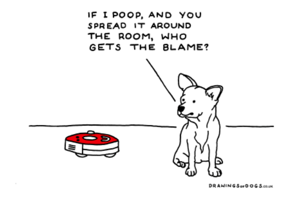

# Useful Articles

Learned by translating useful Articles

[Coding](https://github.com/CasselKim/UsefulArticles#coding)  

[AI](https://github.com/CasselKim/UsefulArticles#ai)  

　  

## Coding

* [나사의 프로그래머처럼 코드짜는법 - 10가지 중요한 규칙들](Coding/NASA/README.md)   

* [10 Tips for Clean Code(Yet)](https://youtu.be/UjhX2sVf0eg)  

* [Google Coding Interview With A Competitive Programmer(Yet)](https://youtu.be/EuPSibuIKIg)  

　  

## AI

* [현재의 인공지능은 지능이 아니라 단순한 커브피팅(Curve Fitting)이다](AI/Curvefitting)  

* **AI Ethics**

  

  * [AI  윤리 원칙 - 방송통신위원회](https://news.naver.com/main/read.nhn?mode=LSD&mid=shm&sid1=105&oid=293&aid=0000025587)  

  * [히치하이커를 위한 AI 윤리 가이드 북(Yet)](https://towardsdatascience.com/ethics-of-ai-a-comprehensive-primer-1bfd039124b0)  

　  
